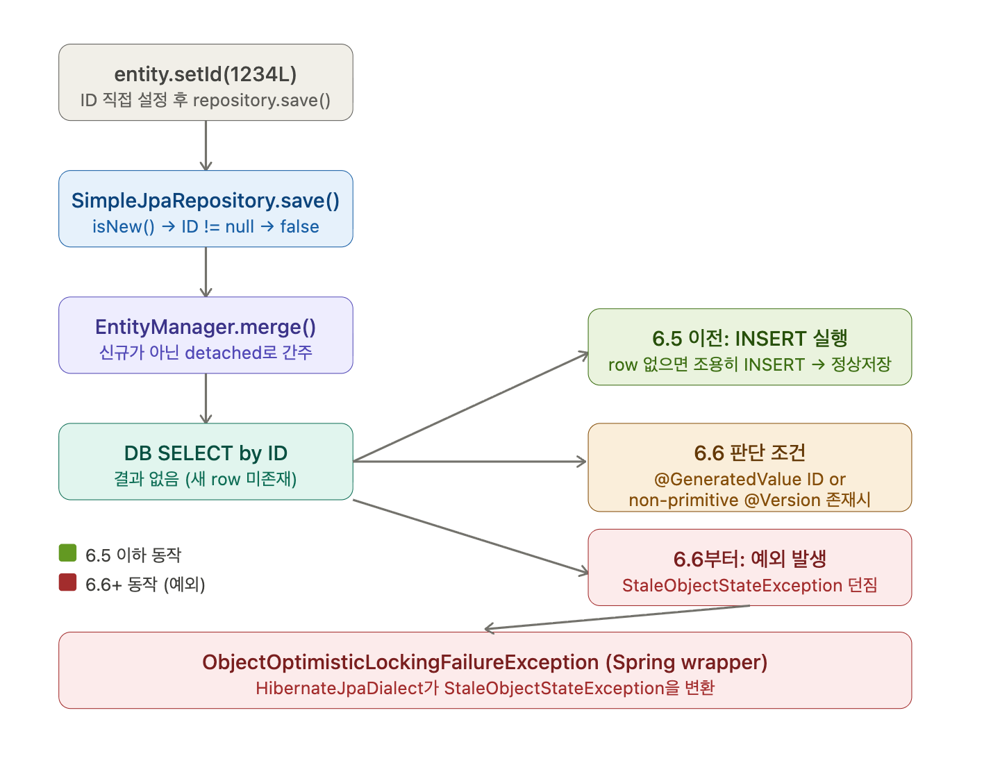

# JPA 에서 Entity ID 에 @GeneratedValue 에 사용자정의 Generator 사용시 마이그레이션 이슈


## 문제점

Hibernate 6.6+ 마이그레이션 시 Entity ID에 @GeneratedValue와 Custom Generator를 함께 사용하면서 ID를 수동으로 설정할 경우, 
Optimistic Locking 규칙 강화로 인해 ObjectOptimisticLockingFailureException 또는 DataIntegrityViolationException이 발생하는 이슈.

### 현상 1

Entity 의 ID 칼럼에 `@Gendratedvalue` 를 사용 -> ID 칼럼 자동생성하지 않고, 직접 설정 -> `ObjectoptimisticLockingFailureException` 발생.

단, `@Generatedvalue` 를 사용하지 않은 경우 오류 발생하지 않음.

### 현상 2

Entity 에서 `@versison` 과 `@Gendratedvalue` 를 같이 사용
  -> ID 칼럼 자동생성하지 않고, 직접 설정
  > `DataIntegrityviolationExcpetion` `Detached entity with generated id'~~ has an unintialized version value nu11 : ~Entity.version`

단, @GeneratedValue 를 사용하지 않은 경우 오류 발생하지 않음.


## 원인 요약

### 핵심: Hibernate **6.6**부터 동작 변경

6.6 Migration Guide의 "Merge versioned entity when row is deleted" 항목에 명시되어 있습니다.

---



------

### 버전별 동작 정리

| 구분 | Hibernate ≤ 6.5 | Hibernate 6.6+ |
|------|----------------|----------------|
| `@GeneratedValue` ID를 수동 설정 후 `save()` | `merge()` 호출 → SELECT → row 없으면 **조용히 INSERT** | `merge()` 호출 → SELECT → row 없으면 **`StaleObjectStateException`** |
| 예외 근거 | 없음 (조용히 통과) | Optimistic Locking 규칙 위반으로 판단 |
| Spring 번역 | 없음 | `HibernateJpaDialect` → `ObjectOptimisticLockingFailureException` |
| 관련 이슈 | — | [HHH-17472](https://hibernate.atlassian.net/browse/HHH-17472) |

---

### 왜 발생하는가 — 근본 원인

**`SimpleJpaRepository.save()` 흐름에서 `isNew()` 판단이 핵심**이다.

ID를 수동으로 설정하면 Hibernate는 해당 인스턴스를 신규(transient)가 아닌 detached(기존에 존재했던) 객체로 간주하여 `merge()`를 실행한다.

`merge()` 내부에서 DB SELECT를 수행하고 row가 없을 때:

- **6.5 이전**: "존재하던 entity가 다른 트랜잭션에서 삭제됐거나, 또는 그냥 transient일 수도 있음" → 불분명하므로 INSERT 수행
- **6.6부터**: `@GeneratedValue` ID 또는 non-primitive `@Version`이 있으면 해당 entity가 detached임을 **확정할 수 있으므로**, row가 없는 것은 "다른 트랜잭션이 삭제한 것"으로 판단하여 `OptimisticLockException`을 던진다. 이전 동작(INSERT 수행)은 Optimistic Locking 규칙 위반이었기 때문에 수정되었다.

---

### isNew() 판단 기준 상세

`allowAssignedIdentifiers=true` 는 Hibernate Generator 내부 설정이며, Spring Data JPA의 `isNew()` 판단과는 별개로 동작한다.

| 조건 | isNew() 판단 기준 | 경로 |
|------|-----------------|------|
| `@Version` 없음 | ID null 여부 | ID non-null → `merge()` |
| `@Version` 있음 | version null 여부 | version null → `persist()` |

따라서 Custom Generator + 직접 ID 할당 시:

- **`@Version` 없음**: ID가 non-null → `merge()` → SELECT 발생
  - AS-IS (5.4.17): SELECT 후 row 없으면 INSERT (조용히 통과)
  - TO-BE (6.6.38): SELECT 후 row 없으면 `OptimisticLockException`
- **`@Version` 있음**: version=null → `persist()` → SELECT 없이 INSERT
  - AS-IS (5.4.17): 정상 INSERT
  - TO-BE (6.6.38): version null 검증 강화 → `DataIntegrityViolationException`

---

### 해결 방법 (간략)

| 방법 | 설명 | 결정 |
|------|------|------|
| **`@GeneratedValue` 제거** | ID 생성 전략 자체를 없애고 assigned ID로 운영 |          |
| **`Persistable` 구현** | `isNew()` 메서드를 오버라이드해 강제로 `persist()` 경로 유도 |           |
| **커스텀 ID Generator** | `allowAssignedIdentifiers()` → `true`를 반환하는 커스텀 Generator 구현으로 수동 ID 허용 | ***적용*** |
| **`entityManager.persist()` 직접 호출** | `save()` 우회, `persist()`는 항상 INSERT |    |

---

### allowAssignedIdentifiers() 를 항상 true 로 반환할 때 테스트 케이스

> **"정상 Batching Execution"의 정의**
> 10건을 배치로 INSERT할 때 중간에 SELECT가 발생하지 않고 INSERT만 실행되는 것.
> 즉, `Hibernate Statistics` 기준으로 `QueryExecutionCount = 0`, `EntityInsertCount = N` 이어야 한다.
>
> **검증 방법**: `hibernate.generate_statistics=true` 활성화 후
> `SessionFactory.getStatistics()`로 INSERT/SELECT 횟수를 직접 카운팅한다.

---

#### 테스트 환경

| 구분 | AS-IS | TO-BE |
|------|-------|-------|
| Spring Boot | 2.3.3.RELEASE | 3.5.6 |
| Hibernate | 5.4.17.Final | 6.6.38.Final |
| JPA Annotation | javax.persistence | jakarta.persistence |
| Generator API | IdentifierGenerator | BeforeExecutionGenerator |

---

#### 1. `@GeneratedValue` (Custom Generator) 사용

| # | 시나리오 | allowAssignedIdentifiers | AS-IS 기대 결과 | TO-BE 기대 결과 |
|---|---------|--------------------------|----------------|----------------|
| 1-1 | 직접 ID 할당, 단건 save | 미적용 | SELECT 1건 → INSERT 1건 (merge 경로) | 오류 (ObjectOptimisticLockingFailureException) |
| 1-2 | 직접 ID 할당, 단건 save | true 적용 | SELECT 1건 → INSERT 1건 (merge 경로) | SELECT 1건 → INSERT 1건 (merge 경로) |
| 1-3 | 자동 ID 생성 (ID 미할당), 단건 save | true 적용 | INSERT 1건, SELECT 0건 | INSERT 1건, SELECT 0건 |
| 1-4 | 직접 ID 할당, 10건 배치 save | 미적용 | - | 오류 (ObjectOptimisticLockingFailureException) |
| 1-5 | 직접 ID 할당, 10건 배치 save | true 적용 | SELECT 10건 → INSERT 10건 (merge 경로, 건별 SELECT) | SELECT 10건 → INSERT 10건 (merge 경로, 건별 SELECT) |
| 1-6 | 자동 ID 생성, 10건 배치 save | true 적용 | INSERT 10건, SELECT 0건 (단일 배치) | INSERT 10건, SELECT 0건 (단일 배치) |

---

#### 2. `@GeneratedValue` (Custom Generator) + `@Version` 사용

| # | 시나리오 | allowAssignedIdentifiers | AS-IS 기대 결과 | TO-BE 기대 결과 |
|---|---------|--------------------------|----------------|----------------|
| 2-1 | 직접 ID 할당, 단건 save | 미적용 | INSERT 1건, SELECT 0건 | 오류 (DataIntegrityViolationException) |
| 2-2 | 직접 ID 할당, 단건 save | true 적용 | INSERT 1건, SELECT 0건 | INSERT 1건, SELECT 0건 |
| 2-3 | 자동 ID 생성 (ID 미할당), 단건 save | true 적용 | INSERT 1건, SELECT 0건 | INSERT 1건, SELECT 0건 |
| 2-4 | 직접 ID 할당, 10건 배치 save | 미적용 | - | 오류 (DataIntegrityViolationException) |
| 2-5 | 직접 ID 할당, 10건 배치 save | true 적용 | INSERT 10건, SELECT 0건 (단일 배치) | INSERT 10건, SELECT 0건 (단일 배치) |
| 2-6 | 자동 ID 생성, 10건 배치 save | true 적용 | INSERT 10건, SELECT 0건 (단일 배치) | INSERT 10건, SELECT 0건 (단일 배치) |

---

### 테스트 결과

> **검증 도구**
> - `Hibernate Statistics`: INSERT/SELECT 횟수 카운팅 (`hibernate.generate_statistics=true`)
> - `datasource-proxy`: JDBC 레벨 `executeBatch()` 호출 횟수 및 batch 묶음 수 카운팅

#### AS-IS (Hibernate 5.4.17) — allowAssignedIdentifiers 미적용

| 테스트 | 결과 | INSERT | SELECT | executeBatch() | batch 묶음 |
|--------|------|--------|--------|----------------|-----------|
| tc1_1 직접ID 단건 (@Version 없음) | ✅ PASS | 1 | 1 (merge 경로) | 1 | 1 |
| tc1_3 자동생성 단건 (@Version 없음) | ✅ PASS | 1 | 0 | 1 | 1 |
| tc1_5 직접ID 배치 10건 (@Version 없음) | ✅ PASS | 10 | **10** (건별 merge) | 1 | 10 |
| tc1_6 자동생성 배치 10건 (@Version 없음) | ✅ PASS | 10 | 0 | 1 | 10 |
| tc2_1 @Version + 직접ID 단건 | ✅ PASS | 1 | 0 | 1 | 1 |
| tc2_3 @Version + 자동생성 단건 | ✅ PASS | 1 | 0 | 1 | 1 |
| tc2_5 @Version + 직접ID 배치 10건 | ✅ PASS | 10 | 0 | 1 | 10 |
| tc2_6 @Version + 자동생성 배치 10건 | ✅ PASS | 10 | 0 | 1 | 10 |

#### TO-BE (Hibernate 6.6.38) — allowAssignedIdentifiers 미적용

| 테스트 | 결과 | 오류 |
|--------|------|------|
| tc1_1 직접ID 단건 | ❌ 오류 재현 | `ObjectOptimisticLockingFailureException` |
| tc1_3 자동생성 단건 | ✅ PASS | - |
| tc1_5 직접ID 배치 10건 | ❌ 오류 재현 | `ObjectOptimisticLockingFailureException` |
| tc1_6 자동생성 배치 10건 | ✅ PASS | - |
| tc2_1 @Version + 직접ID 단건 | ❌ 오류 재현 | `DataIntegrityViolationException` |
| tc2_3 @Version + 자동생성 단건 | ✅ PASS | - |
| tc2_5 @Version + 직접ID 배치 10건 | ❌ 오류 재현 | `DataIntegrityViolationException` |
| tc2_6 @Version + 자동생성 배치 10건 | ✅ PASS | - |

#### TO-BE (Hibernate 6.6.38) — allowAssignedIdentifiers=true 적용

| 테스트 | 결과 | INSERT | SELECT | executeBatch() | batch 묶음 |
|--------|------|--------|--------|----------------|-----------|
| tc1_1 직접ID 단건 (@Version 없음) | ✅ PASS | 1 | 1 (merge 경로) | 1 | 1 |
| tc1_3 자동생성 단건 (@Version 없음) | ✅ PASS | 1 | 0 | 1 | 1 |
| tc1_5 직접ID 배치 10건 (@Version 없음) | ✅ PASS | 10 | **10** (건별 merge) | 1 | 10 |
| tc1_6 자동생성 배치 10건 (@Version 없음) | ✅ PASS | 10 | 0 | 1 | 10 |
| tc2_1 @Version + 직접ID 단건 | ✅ PASS | 1 | 0 | 1 | 1 |
| tc2_3 @Version + 자동생성 단건 | ✅ PASS | 1 | 0 | 1 | 1 |
| tc2_5 @Version + 직접ID 배치 10건 | ✅ PASS | 10 | 0 | 1 | 10 |
| tc2_6 @Version + 자동생성 배치 10건 | ✅ PASS | 10 | 0 | 1 | 10 |

#### 결론

- **AS-IS와 TO-BE(적용 후) 동작 완전 일치**
- **JDBC 레벨 batch 동작 확인**: `executeBatch()` 1회 호출, 10건 묶음 → 단건 INSERT 10번이 아닌 실제 batch 전송 검증됨
- **`@Version` 없음 + 직접ID 할당 시 SELECT 발생**: `allowAssignedIdentifiers=true` 적용 여부와 무관하게 Spring Data JPA `isNew()=false` → `merge()` → **건별 SELECT 발생** (단건 1회, 배치 10건 시 10회)
- `CustomIdGenerator.java` 에 메서드 하나 추가로 해결:

```java
@Override
public boolean allowAssignedIdentifiers() {
    return true;
}
```

이 설정으로 Hibernate 6.6이 직접 ID가 할당된 엔티티를 `isNew()=true`로 인식 → `persist()` 경로 진입 → SELECT 없이 INSERT만 발생 → 정상 Batching 복원.

> **주의**: `@Version` 없는 엔티티에 직접 ID를 할당하면 `allowAssignedIdentifiers=true` 적용 여부와 무관하게 Spring Data JPA의 `isNew()=false` 판단으로 `merge()` 경로를 타며 **SELECT가 1건 발생**한다. SELECT 없이 INSERT만 하려면 `@Version` 필드를 추가하거나 `Persistable` 인터페이스를 구현해야 한다.

---

### SELECT 발생 정밀 재확인

> Hibernate `QueryExecutionCount`는 JPQL/HQL만 카운팅하며, `merge()` 내부의 PK 조회 SELECT는 카운팅하지 않는다.
> 정확한 SELECT 횟수는 `datasource-proxy`의 JDBC 레벨 카운팅으로 확인해야 한다.

| 테스트 | Hibernate QueryCount | JDBC SELECT | isNew() | 경로 |
|--------|---------------------|-------------|---------|------|
| tc1_1 직접ID 단건 (@Version 없음) | 0 | **1** | false | merge() |
| tc1_3 자동생성 단건 (@Version 없음) | 0 | 0 | true | persist() |
| tc1_5 직접ID 배치 10건 (@Version 없음) | 0 | **10** (건별 merge) | false | merge() × 10 |
| tc1_6 자동생성 배치 10건 (@Version 없음) | 0 | 0 | true | persist() × 10 |
| tc2_1 @Version + 직접ID 단건 | 0 | 0 | true | persist() |
| tc2_3 @Version + 자동생성 단건 | 0 | 0 | true | persist() |
| tc2_5 @Version + 직접ID 배치 10건 | 0 | 0 | true | persist() × 10 |
| tc2_6 @Version + 자동생성 배치 10건 | 0 | 0 | true | persist() × 10 |

AS-IS, TO-BE 모두 동일한 결과.

> **핵심**: `@Version` 없음 + 직접ID 할당은 배치에서도 건별로 SELECT가 발생한다.
> SELECT 없이 완전한 Batching을 원한다면 `@Version` 필드 추가가 필요하다.

---

### 중복 ID 할당 시 동작 검증

이미 DB에 존재하는 ID를 직접 할당했을 때의 동작을 추가 검증함.

| 테스트 | AS-IS | TO-BE (allowAssignedIdentifiers=true) |
|--------|-------|--------------------------------------|
| tc_dup1: 기존ID 중복 단건 (`@Version` 없음) | SELECT → UPDATE (오류 없음) | SELECT → UPDATE (오류 없음) |
| tc_dup2: 기존ID 중복 단건 (`@Version` 있음) | INSERT 시도 → DB PK 중복 오류 | INSERT 시도 → DB PK 중복 오류 |

**핵심 발견:**
- `@Version` 없는 엔티티: ID non-null → Spring Data JPA가 `merge()` 경로 선택 → SELECT 발생 → 기존 row 있으면 UPDATE
- `@Version` 있는 엔티티: version=null → `persist()` 경로 → SELECT 없이 INSERT 시도 → PK 중복 오류
- AS-IS / TO-BE (적용 후) 동작 완전 일치
- `allowAssignedIdentifiers=true` 는 Hibernate Generator 내부 설정이며 중복 ID 방어와 무관. 중복 ID 방어는 DB PK 제약에 의존함.

